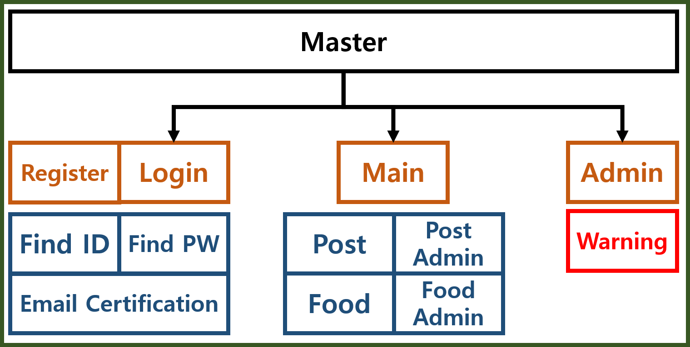
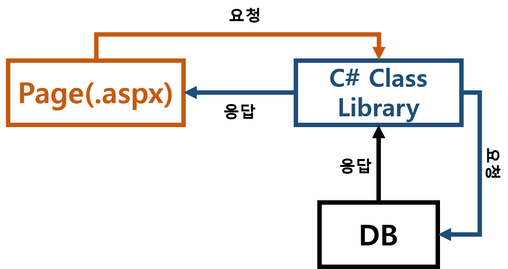
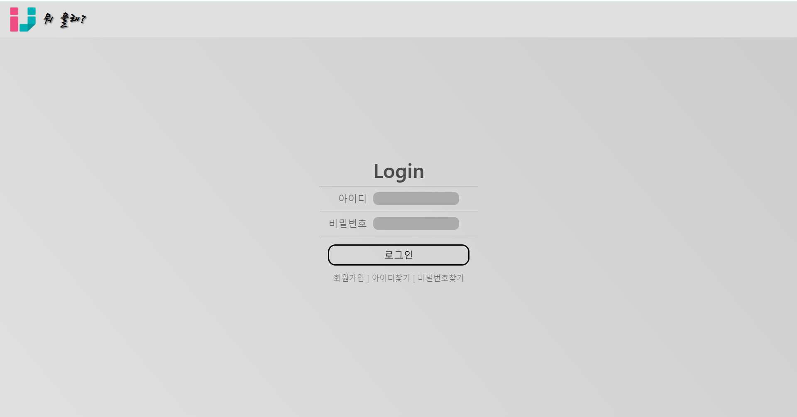

# 인제대에서 뭐 물래?(Ranking Food in Inje)
Summary
---

byungjin.dev@gmail.com

This Application is Web Site for ranking food in Inje University.

In this Web, we don't use JavaScript. So, All dynamics elements are implemented CSS animation.

This Web use SMTP. When you register this Application you have to certify E-Mail.

And for find Password, we use email to identify User and send Password.

And we make C# Library(ViewUtility) for interaction DB and View...

+ DataBase - MsSql

+ Language - C#(Asp.net)

Library Structure(ViewUtility)
---

+ dbControl - for interacting between Server and DataBase

+ VLog - write Log

+ VMail - SMTP, certify User Email(using google smtp server)

+ VRender - create View using DataBase Information.

+ VRouter - Routhing Address

DataBase Table
---
+ foodData
    + Id
    + parentId
    + writer
    + foodStar
    + postData
    + comment
    + gender   
    + writerId
   
+ postData
    + Id
    + postKind
    + postFood
    + postStar
    + postTime
    + postDes
    + imageURL
    + commentCount
   
+ userData
    + Id
    + userId
    + userPw
    + Email
    + joinTime
    + code
    + certification
    + gender
    + userName
    + class
   
+ userLog
    + Id
    + userId
    + connection
    + time
    + postKind
    + postItem
    + accessIP
   
Picture
---
+ Tree

+ Interaction

+ Login
